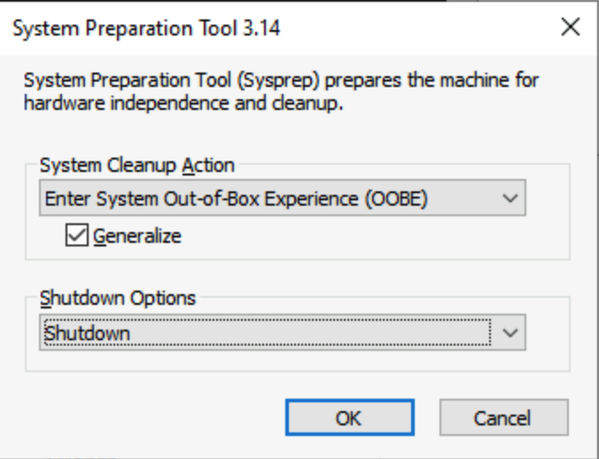
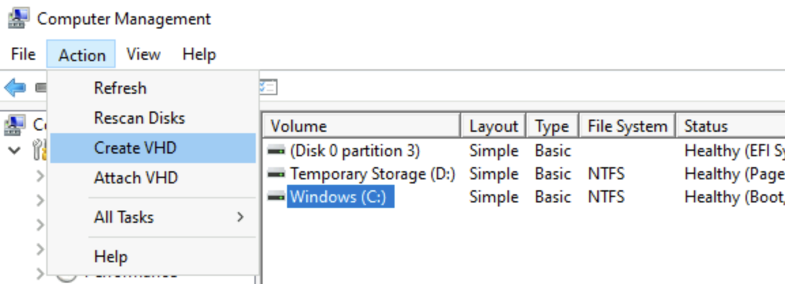
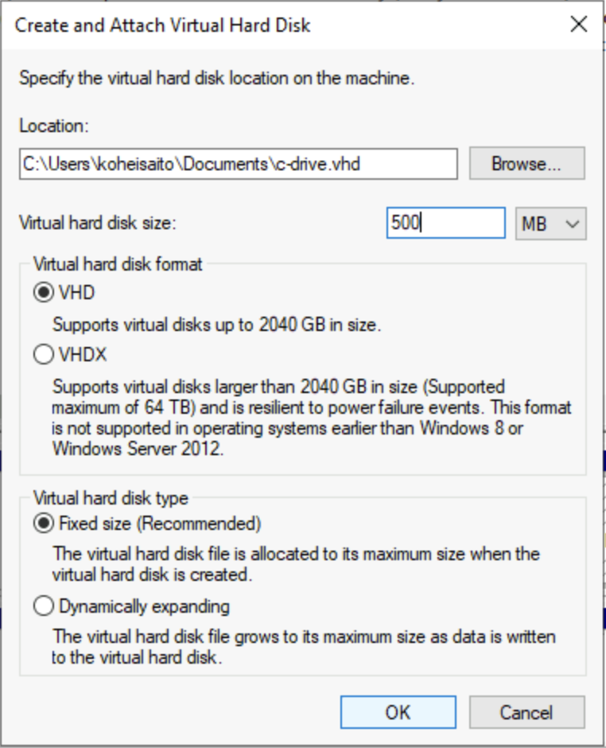
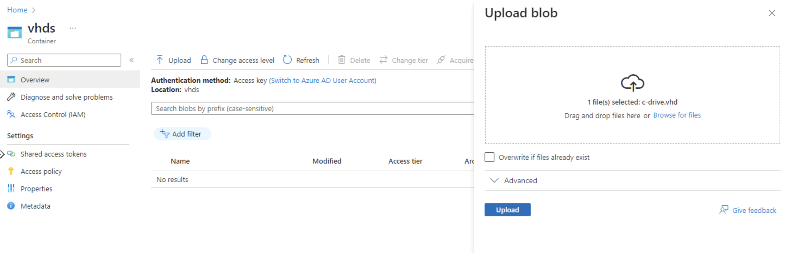
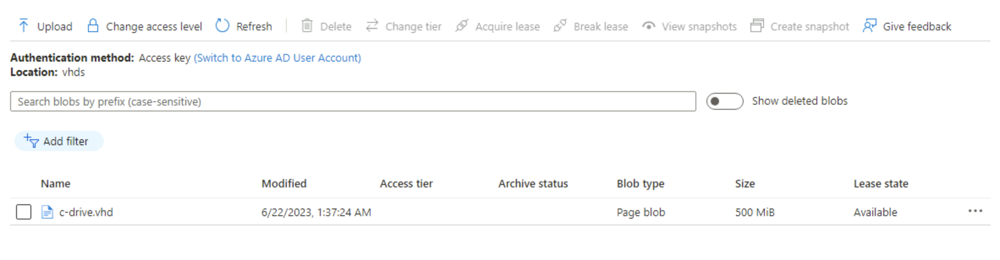
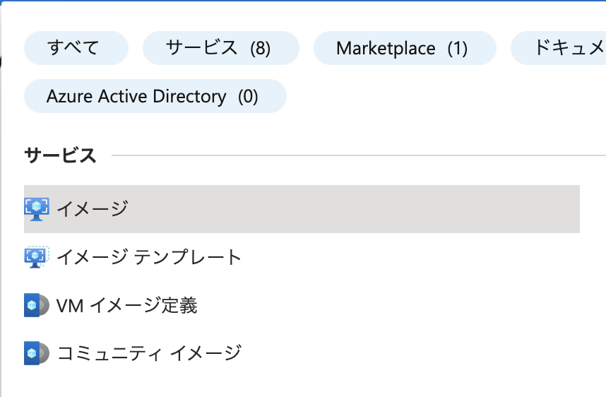
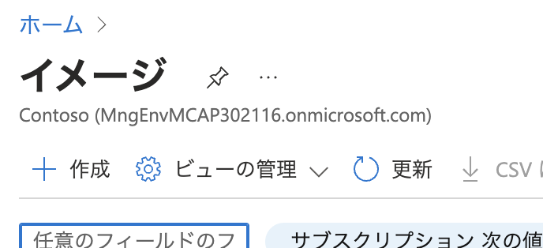
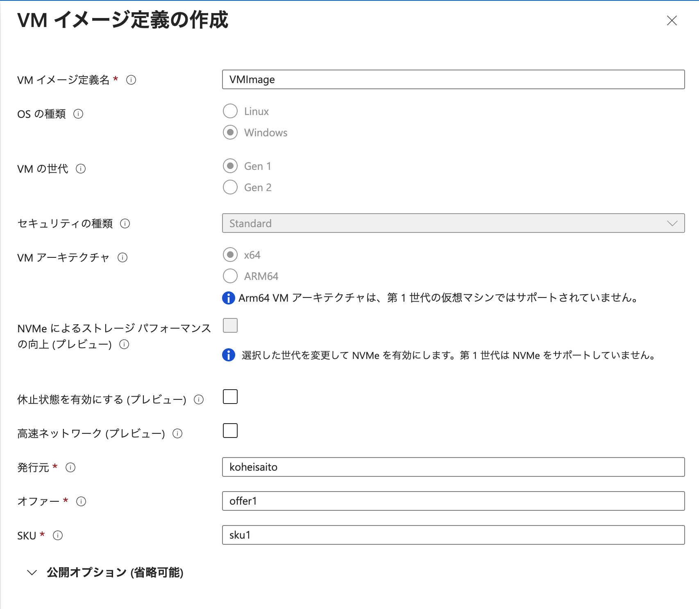

Azure Migrate with VHD Hands-on lab  
July. 2023

<br />

### コンテンツ

- [Exercise 1: 移行準備](#exercise-1-移行準備)

- [Exercise 2: Azure VM へ移行](#exercise-2-AzureVMへ移行)

- [Exercise 3: VM イメージの管理](#exercise-3-VMイメージの管理)

<br />

## Exercise 1: 移行準備

### Task 1: VHD ファイルの作成

- Windows システム ファイル チェッカー ユーティリティの実行

```powershell
sfc.exe /scannow
```

- ※以下が出力されることを確認。

  ```
  Beginning system scan.  This process will take some time.

  Beginning verification phase of system scan.
  Verification 100% complete.

  Windows Resource Protection did not find any integrity violations.
  ```

- Azure 用の Windows 構成を設定。

  - WinHTTP プロキシを削除

  ```powershell
  netsh.exe winhttp reset proxy
  ```

  - **※VM で特定のプロキシを使用する必要がある場合は、次のように Azure の IP アドレス (168.63.129.16) にプロキシ例外を追加。これにより VM は Azure に接続可能になる。**

  ```powershell
  $proxyAddress='<your proxy server>'
  $proxyBypassList='<your list of bypasses>;168.63.129.16'
  netsh.exe winhttp set proxy $proxyAddress $proxyBypassList
  ```

  - DiskPart を開き、ディスク SAN ポリシーを Onlineall に設定。

  ```
  diskpart.exe


  DISKPART> san policy=onlineall
  DISKPART> exit
  ```

  - Windows の協定世界時 (UTC) の時刻を設定し、Windows Time サービス (w32time) の起動の種類を Automatic に変更。

  ```powershell
  Set-ItemProperty -Path HKLM:\SYSTEM\CurrentControlSet\Control\TimeZoneInformation -Name RealTimeIsUniversal -Value 1 -Type DWord -Force
  Set-Service -Name w32time -StartupType Automatic
  ```

  - 電源プロファイルを高パフォーマンスに設定。

  ```powershell
  powercfg.exe /setactive SCHEME_MIN
  powercfg /setacvalueindex SCHEME_CURRENT SUB_VIDEO VIDEOIDLE 0
  ```

  - 環境変数の TEMP と TMP が既定値に設定されていることを確認。

  ```powershell
  Set-ItemProperty -Path 'HKLM:\SYSTEM\CurrentControlSet\Control\Session Manager\Environment' -Name TEMP -Value "%SystemRoot%\TEMP" -Type ExpandString -Force
  Set-ItemProperty -Path 'HKLM:\SYSTEM\CurrentControlSet\Control\Session Manager\Environment' -Name TMP -Value "%SystemRoot%\TEMP" -Type ExpandString -Force
  ```

- Windows サービスの確認

  - 各 Windows サービスが Windows の既定値に設定されていることを確認。

  ```powershell
  Get-Service -Name BFE, Dhcp, Dnscache, IKEEXT, iphlpsvc, nsi, mpssvc, RemoteRegistry |
    Where-Object StartType -ne Automatic |
      Set-Service -StartupType Automatic

  Get-Service -Name Netlogon, Netman, TermService |
    Where-Object StartType -ne Manual |
      Set-Service -StartupType Manual
  ```

- リモート デスクトップのレジストリ設定を更新

  - リモート デスクトップ プロトコル (RDP) が有効になっていることを確認。

  ```powershell
  Set-ItemProperty -Path 'HKLM:\SYSTEM\CurrentControlSet\Control\Terminal Server' -Name fDenyTSConnections -Value 0 -Type DWord -Force
  Set-ItemProperty -Path 'HKLM:\SOFTWARE\Policies\Microsoft\Windows NT\Terminal Services' -Name fDenyTSConnections -Value 0 -Type DWord -Force
  ```

  - RDP ポートが既定のポート 3389 を使用してセットアップしていることを確認。

  ```powershell
  Set-ItemProperty -Path 'HKLM:\SYSTEM\CurrentControlSet\Control\Terminal Server\Winstations\RDP-Tcp' -Name PortNumber -Value 3389 -Type DWord -Force
  ```

  - リスナーがすべてのネットワーク インターフェイスでリッスンするようセット。

  ```powershell
  Set-ItemProperty -Path 'HKLM:\SYSTEM\CurrentControlSet\Control\Terminal Server\Winstations\RDP-Tcp' -Name LanAdapter -Value 0 -Type DWord -Force
  ```

  - RDP 接続のネットワーク レベル認証 (NLA) モードを構成。

  ```powershell
  Set-ItemProperty -Path 'HKLM:\SYSTEM\CurrentControlSet\Control\Terminal Server\WinStations\RDP-Tcp' -Name UserAuthentication -Value 1 -Type DWord -Force
  ```

  - キープアライブ値・再接続オプション・同時接続数を設定。

  ```powershell
  Set-ItemProperty -Path 'HKLM:\SOFTWARE\Policies\Microsoft\Windows NT\Terminal Services' -Name KeepAliveEnable -Value 1  -Type DWord -Force
  Set-ItemProperty -Path 'HKLM:\SOFTWARE\Policies\Microsoft\Windows NT\Terminal Services' -Name KeepAliveInterval -Value 1  -Type DWord -Force
  Set-ItemProperty -Path 'HKLM:\SYSTEM\CurrentControlSet\Control\Terminal Server\Winstations\RDP-Tcp' -Name KeepAliveTimeout -Value 1 -Type DWord -Force

  Set-ItemProperty -Path 'HKLM:\SOFTWARE\Policies\Microsoft\Windows NT\Terminal Services' -Name fDisableAutoReconnect -Value 0 -Type DWord -Force
  Set-ItemProperty -Path 'HKLM:\SYSTEM\CurrentControlSet\Control\Terminal Server\Winstations\RDP-Tcp' -Name fInheritReconnectSame -Value 1 -Type DWord -Force
  Set-ItemProperty -Path 'HKLM:\SYSTEM\CurrentControlSet\Control\Terminal Server\Winstations\RDP-Tcp' -Name fReconnectSame -Value 0 -Type DWord -Force

  Set-ItemProperty -Path 'HKLM:\SYSTEM\CurrentControlSet\Control\Terminal Server\Winstations\RDP-Tcp' -Name MaxInstanceCount -Value 4294967295 -Type DWord -Force
  ```

  - RDP リスナーに関連付けられている自己署名証明書をすべて削除。

  ```powershell
  if ((Get-Item -Path 'HKLM:\SYSTEM\CurrentControlSet\Control\Terminal Server\WinStations\RDP-Tcp').Property -contains 'SSLCertificateSHA1Hash')
  {
      Remove-ItemProperty -Path 'HKLM:\SYSTEM\CurrentControlSet\Control\Terminal Server\WinStations\RDP-Tcp' -Name SSLCertificateSHA1Hash -Force
  }
  ```

- Windows ファイアウォール規則を構成

  - 3 つのプロファイル (ドメイン、標準、パブリック) で Windows ファイアウォールを有効化。

  ```powershell
  Set-NetFirewallProfile -Profile Domain, Public, Private -Enabled True
  ```

  - 3 つのファイアウォール プロファイル (ドメイン、プライベート、パブリック) を通じて WinRM を許可し、PowerShell リモート サービスを有効化。

  ```powershell
  Enable-PSRemoting -Force
  ```

  - RDP トラフィックを許可するために以下のファイアウォール規則を有効化。

  ```powershell
  Get-NetFirewallRule -DisplayGroup 'Remote Desktop' | Set-NetFirewallRule -Enabled True
  ```

  - VM が仮想ネットワーク内部の ping 要求に応答できるように、"ファイルとプリンターの共有" 規則を有効化。

  ```powershell
  Set-NetFirewallRule -Name FPS-ICMP4-ERQ-In -Enabled True
  ```

  - Azure プラットフォーム ネットワークのルールを作成

  ```powershell
  New-NetFirewallRule -DisplayName AzurePlatform -Direction Inbound -RemoteAddress 168.63.129.16 -Profile Any -Action Allow -EdgeTraversalPolicy Allow
  New-NetFirewallRule -DisplayName AzurePlatform -Direction Outbound -RemoteAddress 168.63.129.16 -Profile Any -Action Allow
  ```

- VM の確認

  - ディスクが正常で一貫性があることを確認するために、次回の VM 再起動時にディスクをチェック。

  ```powershell
  chkdsk.exe /f
  ```

  - ブート構成データ (BCD) を設定。

  ```powershell
  cmd

  bcdedit.exe /set "{bootmgr}" integrityservices enable
  bcdedit.exe /set "{default}" device partition=C:
  bcdedit.exe /set "{default}" integrityservices enable
  bcdedit.exe /set "{default}" recoveryenabled Off
  bcdedit.exe /set "{default}" osdevice partition=C:
  bcdedit.exe /set "{default}" bootstatuspolicy IgnoreAllFailures

  #Enable Serial Console Feature
  bcdedit.exe /set "{bootmgr}" displaybootmenu yes
  bcdedit.exe /set "{bootmgr}" timeout 5
  bcdedit.exe /set "{bootmgr}" bootems yes
  bcdedit.exe /ems "{current}" ON
  bcdedit.exe /emssettings EMSPORT:1 EMSBAUDRATE:115200

  exit
  ```

  - Dump ログ コレクションを有効化。

  ```powershell
  # Set up the guest OS to collect a kernel dump on an OS crash event
  Set-ItemProperty -Path 'HKLM:\SYSTEM\CurrentControlSet\Control\CrashControl' -Name CrashDumpEnabled -Type DWord -Force -Value 2
  Set-ItemProperty -Path 'HKLM:\SYSTEM\CurrentControlSet\Control\CrashControl' -Name DumpFile -Type ExpandString -Force -Value "%SystemRoot%\MEMORY.DMP"
  Set-ItemProperty -Path 'HKLM:\SYSTEM\CurrentControlSet\Control\CrashControl' -Name NMICrashDump -Type DWord -Force -Value 1

  # Set up the guest OS to collect user mode dumps on a service crash event
  $key = 'HKLM:\SOFTWARE\Microsoft\Windows\Windows Error Reporting\LocalDumps'
  if ((Test-Path -Path $key) -eq $false) {(New-Item -Path 'HKLM:\SOFTWARE\Microsoft\Windows\Windows Error Reporting' -Name LocalDumps)}
  New-ItemProperty -Path $key -Name DumpFolder -Type ExpandString -Force -Value 'C:\CrashDumps'
  New-ItemProperty -Path $key -Name CrashCount -Type DWord -Force -Value 10
  New-ItemProperty -Path $key -Name DumpType -Type DWord -Force -Value 2
  Set-Service -Name WerSvc -StartupType Manual
  ```

  - Windows Management Instrumentation (WMI) リポジトリに一貫性があることを確認。

  ```powershell
  winmgmt.exe /verifyrepository
  ```

  - TermService 以外のアプリケーションがポート 3389 を使用していないことを確認（Azure の RDP サービスに使用するため）。

  ```powershell
  netstat.exe -anob
  ```

  - VM を再起動。

- VHD の一般化

  - Windows VM にサインイン。

  - PowerShell セッションを管理者として実行。

  - panther ディレクトリ (C:\Windows\Panther) を削除

  ```powershell
  rm C:\Windows\Panther
  ```

  - sysprep を実行

  ```powershell
  cd C:\Windows\System32\Sysprep
  .\sysprep.exe
  ```

  - [シャットダウン オプション] の [シャットダウン] を選択し、**OK**を選択。

  - Sysprep 完了後、VM をシャットダウン。

  

- タスクバーの検索ボックスに、「コンピューターの管理」と入力し、**ディスクの管理** を選択。

- 移行対象のボリュームを選択。

- [アクション] メニューで、 **VHD の作成** を選択。



- [仮想ハード ディスクの作成と接続] ダイアログ ボックスで、VHD ファイルを格納する物理コンピューター上の場所を指定。

  - [場所] で [参照] ボタンを選択し、VHD を格納するフォルダーを選択。
  - [ファイル名] フィールドにドライブの名前を入力。
  - [ファイルの種類] ドロップダウン メニューから [仮想ディスク ファイル (*.vhd)] を選択。
  - **保存** を選択。

- [Virtual hard disk size] (仮想ハード ディスク サイズ) の下にファイル サイズを入力。

- [仮想ハード ディスクの種類] で **固定サイズ** を選択。

- **OK** を選択して作業を終了。



### Task 2: Blob ストレージへ VHD ファイルをアップロード

- [Azure Portal](https://portal.azure.com) にログインし、該当の**ストレージアカウント**を選択。

- **コンテナー**、**vhds** を選択。

- Task 1 にて作成した VHD ファイルをアップロード。



- アップロードされていることを確認。



## Exercise 2: Azure VM へ移行

### Task 1: イメージ作成

- [Azure Portal](https://portal.azure.com) の検索バーに **イメージ** と入力し、**イメージ**を選択。



- **[+ 作成]** を選択。



- "**基本**" タブ

  - "**プロジェクトの詳細**"

    - "**サブスクリプション**": ワークショップで使用中のサブスクリプションを選択

    - "**リソース グループ**": ワークショップで使用中のリソース グループを選択

  - "**インスタンスの詳細**"

    - "**名前**": image1（任意）

    - "**地域**": 任意

    - "**ゾーンの回復性**": 無効化（既定）

    - "**ストレージ Blob**": Exercise 1 にてアップロードした VHD ファイルを選択。

    - "**アカウントの種類**": **Premium SSD**

    - "**ホストキャッシュ**": **読み取り/書き込み**"

    - "**キーの管理**": プラットフォームマネージドキー

    - **確認及び作成** をクリックし、**作成** を選択。

### Task 2: VM 作成

- **リソースに移動**を選択。

- **+ VM の作成** を選択。

- "**基本**" タブ

  - "**プロジェクトの詳細**"

    - "**サブスクリプション**": ワークショップで使用中のサブスクリプションを選択

    - "**リソース グループ**": ワークショップで使用中のリソース グループを選択

  - "**インスタンスの詳細**"

    - "**仮想マシン名**": vm1（任意）

    - "**地域**": 任意

    - "**可用性オプション**": インフラストラクチャ冗長は必要ありません

    - "**イメージ**": Task 1 で作成したイメージ

    - "**VM アーキテクチャ**": **x64**

    - "**Azure Spot 割引で実行する**": 無効化（既定）

    - "**サイズ**": Standard_D2s_v3（任意）

    - **確認及び作成** をクリックし、**作成** を選択。

  - "**管理者アカウント**"

    - "**ユーザー名**": 任意

    - "**パスワード**": 任意

    - "**パスワードの確認**": 任意

  - "**受信ポートの規則**"

    - "**パブリック受信ポート**": なし

  - "**ライセンス**"

    - "**ライセンスの種類**": Windows Server

- **ネットワーク** タブへ移動

  - "**ネットワークインターフェース**"

    - "**仮想ネットワーク**": ワークショップで使用している仮想ネットワーク

    - "**サブネット**": **default**

    - "**パブリック IP**": なし

    - "**ネットワークセキュリティグループ**": **なし**

    - "**VM が削除されたときにパブリック IP と NIC を削除する**": **有効化**

- **確認及び作成**を選択し、**作成**をクリック。

## Exercise 3: VM イメージの管理

- [Azure Portal](https://portal.azure.com) の検索バーに **イメージ** と入力し、**イメージ**を選択。


- Exercise 2 にて作成したイメージを選択。

- **VM イメージに複製する** を選択。

- "**基本**" タブ

  - "**プロジェクトの詳細**"

    - "**サブスクリプション**": ワークショップで使用中のサブスクリプションを選択

    - "**リソース グループ**": ワークショップで使用中のリソース グループを選択

  - "**インスタンスの詳細**"

    - "**地域**": 既定のまま

  - "**バージョンの詳細**"

    - "**バージョン番号**": **0.0.1**

    - その他の項目は規定のまま

  - "**ギャラリーの詳細**"

    - "**ターゲット Azure コンピュートギャラリー**": ハンズオンで使用する Azure コンピュートギャラリー

    - "**ターゲット VM イメージ定義**": **新規作成** をクリック

      - "**VM イメージ定義名**": **VMImage**（任意）

      - "**発行元**"、"**オファー**"、"**SKU**": 任意の値（VM イメージを管理するための情報）

      

- "**レプリケーション**" タブ

  - "**既定のストレージ SKU**": **ゾーン冗長**

  - "**規定のレプリカ数**": 1

  - "**ターゲットリージョン**": 既定のまま

- **確認および作成**を選択し、**作成**をクリック

- ギャラリー内にイメージ定義が作成されていることを確認。


