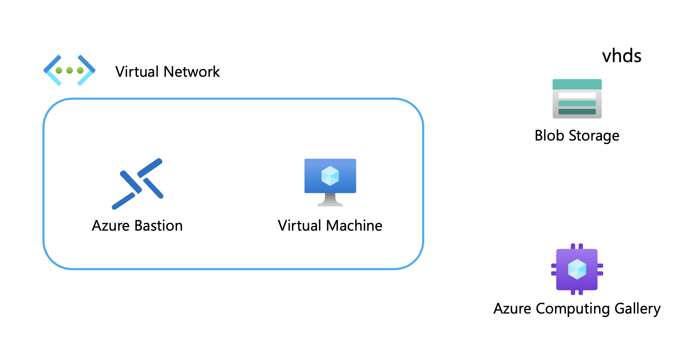

## VHD ファイルを活用した Azure VM への移行

### 事前準備

以下のボタンを押下し、ハンズオンに使用するリソースを展開。

<a href="https://portal.azure.com/#create/Microsoft.Template/uri/https%3A%2F%2Fraw.githubusercontent.com%2Fkohei3110%2FAzureMigrate-with-VHD%2Fmain%2Ftemplates%2Fresources.json">
  
</a>



## 注意点

- ディスクサイズの変更（Azure のディスクの仮想サイズは、1 MB 単位にアラインする必要がある）

  - もし 1MiB にアラインしていない場合、以下のエラーが発生する。

  ```
  {"code":"DeploymentFailed","target":"/subscriptions/xxxxxxxxx/resourceGroups/rg-xxxxxxx/providers/Microsoft.Resources/deployments/Microsoft.Image-2023xxxxxxxx","message":"At least one resource deployment operation failed. Please list deployment operations for details. Please see https://aka.ms/arm-deployment-operations for usage details.","details":[{"code":"InvalidParameter","target":"disks","message":"The specified cookie value in VHD footer indicates that disk 'xxxx.vhd' with blob https://xxxxxxxx.blob.core.windows.net:8443/vhds/xxxx.vhd is not a supported VHD. Disk is expected to have cookie value 'conectix'."}]}
  ```

  - 1 MB の倍数にリサイズする必要がある。

  ```powershell
  Resize-VHD -Path .\abcd.vhd -SizeBytes 144000MB
  ```

  参考: [仮想ディスクを容量固定の VHD に変換する](https://learn.microsoft.com/ja-jp/azure/virtual-machines/windows/prepare-for-upload-vhd-image#convert-the-virtual-disk-to-a-fixed-size-vhd)
